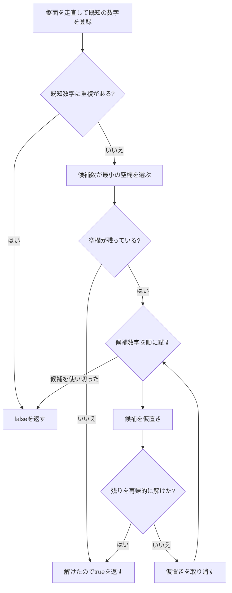

# ソルバーのアルゴリズム

## 概要

ソルバーは候補数字を仮に置き、矛盾が起きたらその選択を取り消して別の候補を試す、深さ優先のバックトラック探索を行います。各手で候補数が最も少ない空欄を選ぶMRV（Minimum Remaining Values）ヒューリスティックを使い、分岐が早く行き詰まるようにしています。



## 1. 盤面と探索状態を初期化する

盤面型は`[[u8; 9]; 9]`です。各セルの値は`1`〜`9`を数字、範囲外（通常は`0`）を空欄として扱います。`solve`は盤面を左上から走査し、数字が入ったセルを探索状態へ登録します。

登録できない数字が見つかった場合、同じ行・列・3×3ブロックに重複があります。その時点で`false`を返します。`1`〜`9`以外の値は空欄として扱い、盤面上でも`0`に正規化します。

## 2. ビットマスクで使用済み数字を表す

`StateManager`は各行、各列、各3×3ブロックについて、すでに置かれた数字を`u16`のビット列で記録します。数字`v`に対応するビットは次の式です。

```text
flag(v) = 1 << (v - 1)
```

たとえば数字1、4、9が使われているとき、対応するビットはそれぞれbit 0、bit 3、bit 8です。セル`(x, y)`の行、列、ブロックのマスクをOR結合すると、そのセルに置けない数字をまとめて得られます。

```text
used(x, y) = row[y] | col[x] | block[y / 3][x / 3]
```

候補は、数字1〜9のうち`used`でビットが立っていない数字です。候補数は使用済みマスクの立っているビット数を数え、`9 - popcount(used)`で求めます。マスクは数字1〜9に対応する下位9ビットだけを使います。

ライブラリAPIの`candidates_for(mtx, x, y)`も同じ制約を調べ、利用可能な数字を昇順のベクターとして返します。UIの候補表示では、マスの位置ごとにこの結果を使います。盤面外の座標と数字がすでに入っているセルには候補を返しません。

`Candidates`イテレーターは未使用ビットを数字1から9の順に調べます。ビット反転で上位ビットも1になりますが、イテレーターは9個の数字を調べた時点で終了するため候補には含まれません。

## 3. 一手ヒントを探す

UIの**Get hint**は`find_hint`を呼び、探索で答えを当てることなく、確定できる一手を探します。判定は次の固定順です。

1. **唯一候補（Naked single）**: 空欄セルに置ける数字が1つだけなら、その数字を返します。
2. **隠れたシングル（Hidden single）**: 行、列、3×3ブロックごとに数字を見て、その単位内で置けるセルが1つだけなら、その位置を返します。

ヒントはセル位置、数字、根拠となる手法を返し、盤面は変更しません。UIは対象セルへフォーカスして説明を表示します。これらの手法で次の一手が決まらない場合は`Ok(None)`です。これはこのヒント機能の対象外という意味で、問題に解がないという判定ではありません。重複または候補が0個の空欄があれば、それぞれエラーとして返します。

## 4. 候補数が最少のセルを選ぶ

空欄の中から`num_candidates`が最小のセルを選びます。候補が0個なら、その時点の仮置きでは解けないので`false`を返し、呼び出し元で別の候補を試します。

候補が最少のセルから選ぶと、そのセルの選択が誤りだった場合に早く矛盾が見つかります。空欄の並びが同じでも、候補数の小さいセルを先に処理するため、総当たりの分岐を抑えられます。

## 5. 仮置きとバックトラック

候補数字をひとつ選び、`StateManager`と盤面の両方に仮置きして、残りの空欄を再帰的に解きます。

- 再帰呼び出しが`true`なら解が見つかったため、その盤面を保持して成功を返します。
- 再帰呼び出しが`false`なら、状態マスクから候補数字を取り除き、別の候補を試します。
- すべての候補で失敗したら、そのセルを`0`へ戻して呼び出し元へ失敗を返します。

空欄がなくなった時点で`true`です。複数解の有無は調べず、探索順で最初に見つかった解を返します。

## 6. Iteratorで解を列挙する

`SolutionSearch::new`は同じMRVとバックトラック探索を使う、上限のないIteratorを作ります。`SolutionFound`イベントを返した後も、利用者が次を要求する限り探索を続けます。探索状態を復元してから次の候補へ進むため、渡された盤面は変更しません。Iteratorをdropすれば、探索を途中で止められます。

- `Progress`イベントは2,048ノードごとに返ります。イベントを消費する側はノード数や解数を確認し、必要なら任意の時点でIteratorをdropできます。
- Iteratorが`None`を返した場合は探索木を最後まで調べ終えており、解数が正確に確定します。途中で消費を止めた場合、得られた解数は下限です。

ブラウザーUIは専用Web Worker内でIteratorを消費し、最大100解・約500,000ノードというUI向け上限を適用します。ノード上限は進捗イベントの間隔で確認するため、実際の訪問数は上限を最大2,047ノード超える場合があります。これらの上限はSolver APIには含めません。Workerの終了でも探索をキャンセルできます。

## 計算量と実装上の範囲

候補が多い盤面では探索分岐が増えるため、バックトラック探索の最悪時の計算量は指数的です。MRVとビットマスクは探索や候補計算を効率化しますが、最悪計算量そのものを多項式にはしません。

Solver本体は候補の仮置きと制約チェックで解きます。単独候補と隠れたシングルは一手ヒント機能が検出しますが、探索を始める前の伝播処理には使いません。ペアなど、ほかの推論規則も実装していません。

## 関連コード

- [`solve`と再帰探索](../src/solver.rs)
- [`candidates_for`](../src/solver.rs)
- [`StateManager`と`Candidates`](../src/solver.rs)
- [ソルバーの単体テスト](../src/solver.rs)
