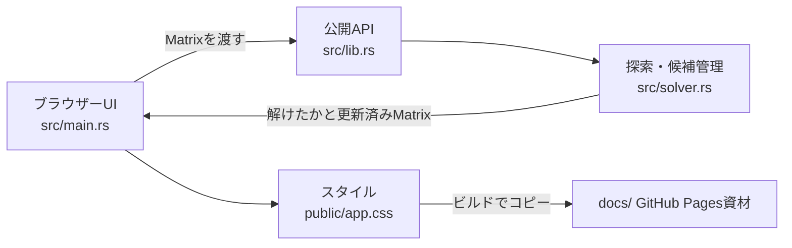

# アプリとコードの構成

## 全体

このリポジトリは、数独の探索処理を提供するRustライブラリと、それを呼び出すDioxus Web UIで構成されています。ソルバーは画面に依存せず、`Matrix`を受け取る関数として公開されています。



## ディレクトリと主要ファイル

| パス | 役割 |
| --- | --- |
| `src/lib.rs` | `Matrix`型、`solve`、`candidates_for`を公開するライブラリ入口 |
| `src/solver.rs` | 重複チェック、候補計算、再帰探索、単体テスト |
| `src/main.rs` | 初期盤面、セル入力、テキスト入出力、Solve/Clear操作 |
| `public/app.css` | Web UIのスタイル。ビルド時に配信資材へコピー |
| `sample_problem/` | テキスト形式の問題例 |
| `documentation/` | 編集する解説資料 |
| `docs/` | GitHub Pagesに配置する生成済みWeb資材 |
| `Cargo.toml` / `Cargo.lock` | Rust依存関係と解決済みバージョン |
| `Dioxus.toml` | Webターゲット、公開先、スタイル、Pagesのbase path |

## ソルバーの公開API

```rust
pub type Matrix = [[u8; 9]; 9];
pub fn solve(mtx: &mut Matrix) -> bool;
pub fn candidates_for(mtx: &Matrix, x: usize, y: usize) -> Vec<u8>;
```

`solve`は盤面を直接更新します。解を見つけると`true`を返し、初期数字の重複や探索失敗では`false`を返します。成功時には数字1〜9だけで埋まった盤面になります。戻り値は成否のみで、失敗理由や解の個数は返しません。

`candidates_for`は空欄セルの行・列・3×3ブロックを調べ、置ける数字を昇順の`Vec<u8>`で返します。埋まったセルや盤面外の座標では空のベクターになります。

詳細は[アルゴリズム解説](algorithm.md)と[盤面形式・APIの使い方](usage.md)を参照してください。

## UIのデータの流れ

画面は盤面、元のヒント数字、メッセージ、テキスト欄をDioxus Signalで保持します。表示時に盤面から重複セルを計算し、該当セルの強調と`aria-invalid`へ反映します。

1. 数字セルの入力を`Matrix`へ反映します。入力したヒントセルは通常の入力セルとして扱います。
2. 入力中に重複を検出し、同じ数字が同じ行・列・3×3ブロックにあるセルを強調します。
3. 候補表示をオンにすると、各空欄について`candidates_for`の結果をセル内へ表示します。候補が0個のセルは別途強調します。
4. Solveボタンで重複と候補切れを先に確認し、問題がなければ盤面のコピーをソルバーへ渡します。
5. 成功時に解を画面へ反映します。探索で解が見つからない場合はメッセージを表示します。
6. テキスト読み込み前に9行×9文字か、使える記号かを検証します。`1`〜`9`は数字、`0`・`.`・`_`は空欄です。
7. テキスト出力では空欄を`_`に置き換えます。
8. 矢印キーで隣のセルへ移動し、数字入力後は次の空欄へフォーカスします。

## 生成物と編集元を分ける

CSSの編集元は`public/app.css`、Rust UIの編集元は`src/main.rs`です。`docs/`は公開用の生成資材なので、手書き解説を置かず、Webアプリの再ビルドで更新します。解説資料の編集元は`documentation/`です。
