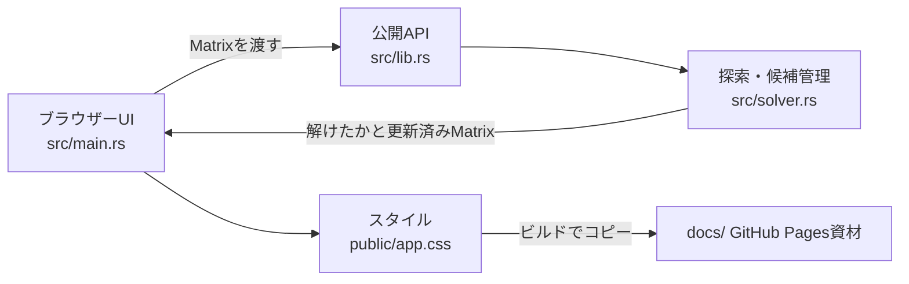

# アプリとコードの構成

## 全体

このリポジトリは、数独の探索処理を提供するRustライブラリと、それを呼び出すDioxus Web UIで構成されています。ソルバーは画面に依存せず、`Matrix`を受け取る関数として公開されています。



## ディレクトリと主要ファイル

| パス | 役割 |
| --- | --- |
| `src/lib.rs` | `Matrix`型と`solve`関数を公開するライブラリ入口 |
| `src/solver.rs` | 重複チェック、候補計算、再帰探索、単体テスト |
| `src/main.rs` | 初期盤面、セル入力、テキスト入出力、Solve/Clear操作 |
| `public/app.css` | Web UIのスタイル。ビルド時に配信資材へコピー |
| `sample_problem/` | テキスト形式の問題例 |
| `documentation/` | 編集する解説資料 |
| `docs/` | GitHub Pagesに配置する生成済みWeb資材 |
| `Cargo.toml` / `Cargo.lock` | Rust依存関係と解決済みバージョン |
| `Dioxus.toml` | Webターゲット、公開先、スタイル、Pagesのbase path |

## ソルバーの公開API

```rust
pub type Matrix = [[u8; 9]; 9];
pub fn solve(mtx: &mut Matrix) -> bool;
```

`solve`は盤面を直接更新します。解を見つけると`true`を返し、初期数字の重複や探索失敗では`false`を返します。成功時には数字1〜9だけで埋まった盤面になります。戻り値は成否のみで、失敗理由や解の個数は返しません。

詳細は[アルゴリズム解説](algorithm.md)と[盤面形式・APIの使い方](usage.md)を参照してください。

## UIのデータの流れ

画面は盤面、メッセージ、テキスト欄をDioxus Signalで保持します。

1. 数字セルの入力を`Matrix`へ反映します。
2. Solveボタンで盤面のコピーをソルバーへ渡します。
3. 成功時に解を画面へ反映します。失敗時はエラーメッセージを表示します。
4. テキスト欄は、9行それぞれ最大9文字を読み込みます。数字以外の文字は空欄として扱います。
5. テキスト出力では空欄を`_`に置き換えます。

## 生成物と編集元を分ける

CSSの編集元は`public/app.css`、Rust UIの編集元は`src/main.rs`です。`docs/`は公開用の生成資材なので、手書き解説を置かず、Webアプリの再ビルドで更新します。解説資料の編集元は`documentation/`です。
